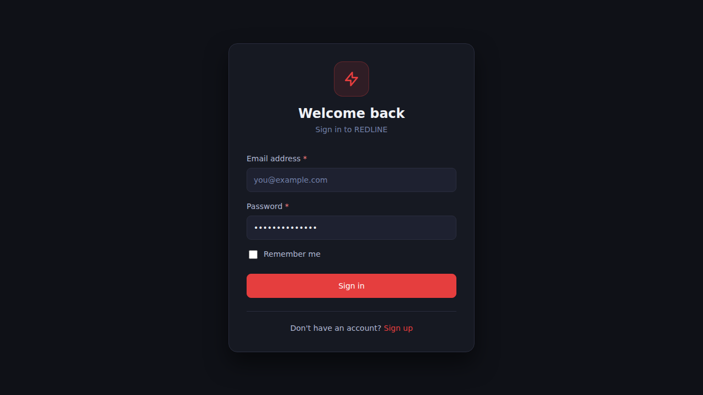
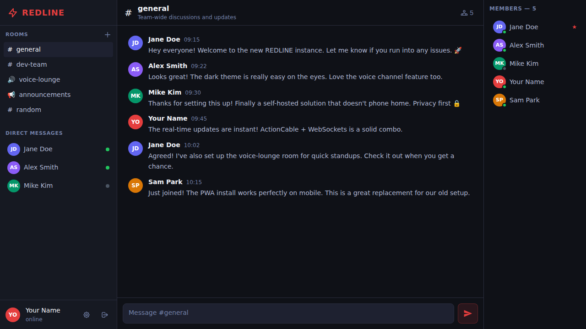
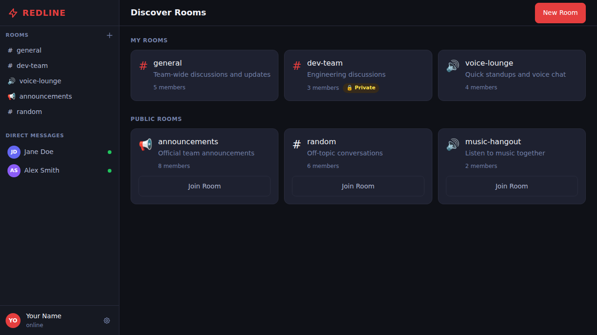

# REDLINE

> **Privacy-first, self-hosted real-time communication platform**

Security via Obscurity — and by design.

---

## 🎯 What is REDLINE?

REDLINE is a production-ready, self-hosted communication platform built for teams and individuals who demand **absolute privacy** and **real-time performance**. Zero telemetry, zero third-party dependencies, your data on your hardware.

### Core Features
- 💬 **Real-time text chat** via ActionCable (WebSockets)
- 🔊 **Voice & video calls** via LiveKit (WebRTC SFU)
- 📨 **Direct messages** between users
- 🏠 **Rooms** — public and private, text/voice/announcement types
- 👥 **Presence system** — online/away/busy/offline status
- 🔒 **Secure auth** — Devise with account locking + rate limiting
- 📱 **Progressive Web App** — installable, offline-capable
- ♿ **WCAG 2.1 AA accessible** — dark-first UI, skip nav, ARIA, keyboard nav

---

## 📸 Screenshots

### Sign In


### Chat Room


### Room Discovery


---

## 🛠️ Technology Stack

| Layer | Technology |
|-------|-----------|
| Backend | Ruby on Rails 7.1 |
| Real-time | ActionCable + WebSockets |
| Media (WebRTC) | LiveKit SFU |
| Database | PostgreSQL 16 |
| Cache / PubSub | Redis 7 |
| Infrastructure | Docker Compose |
| Auth | Devise (bcrypt, lockable) |
| Rate limiting | Rack::Attack |
| Frontend | Hotwire (Turbo + Stimulus) |
| PWA | Service Worker + Web Manifest |

---

## 🚀 Quick Start (Docker)

```bash
# 1. Clone and configure
git clone https://github.com/DocwatZ/REDLINE_ONLINE.git
cd REDLINE_ONLINE
cp .env.example .env
# Edit .env — fill in SECRET_KEY_BASE, POSTGRES_PASSWORD, REDIS_PASSWORD, LIVEKIT keys

# 2. Generate a secret key
docker run --rm ruby:3.2-slim ruby -e "require 'securerandom'; puts SecureRandom.hex(64)"

# 3. Start everything
docker compose up -d

# 4. Open in browser
open http://localhost:3000
```

---

## ⚙️ Environment Variables

See `.env.example` for all required variables.

| Variable | Description |
|----------|-------------|
| `SECRET_KEY_BASE` | Rails secret key (generate with `rails secret`) |
| `DATABASE_URL` | PostgreSQL connection string |
| `REDIS_URL` | Redis connection string |
| `LIVEKIT_URL` | LiveKit server WebSocket URL |
| `LIVEKIT_API_KEY` | LiveKit API key |
| `LIVEKIT_API_SECRET` | LiveKit API secret |

---

## 🏗️ Architecture

```
Browser ──── Rails (Puma) ──── PostgreSQL
   │              │
   │         ActionCable ──── Redis (PubSub)
   │              │
 WebRTC ──── LiveKit SFU ──── TURN Server
```

---

## ♿ Accessibility

REDLINE is built **accessibility-first**:

- **Dark mode by default** with WCAG 2.1 AA+ contrast ratios (text ≥ 4.5:1)
- **Skip navigation** link (first focusable element on every page)
- **ARIA labels** on all interactive elements
- **Keyboard navigable** — full Tab/Enter/Escape support
- **Screen reader** compatible — role="log" for chat, aria-live regions
- **44×44px minimum** touch targets for all buttons (WCAG 2.5.5)
- **Focus-visible** rings on all interactive elements
- **Reduced motion** support via prefers-reduced-motion

---

## 🔒 Security

- Minimum 12-character passwords enforced
- Account locking after 10 failed attempts (email unlock)
- Rate limiting on auth endpoints via Rack::Attack
- CSRF protection on all forms
- Non-root Docker container
- All secrets via environment variables (never in code)

---

## 🏠 Self-Hosting (Unraid / TrueNAS)

1. Deploy using the included `docker-compose.yml`
2. Reverse proxy with NGINX or Traefik for HTTPS/WSS
3. Configure LiveKit with STUN/TURN for external call reliability
4. See `livekit.yaml` for LiveKit SFU configuration

---

## 📄 License

REDLINE is open-source software.
